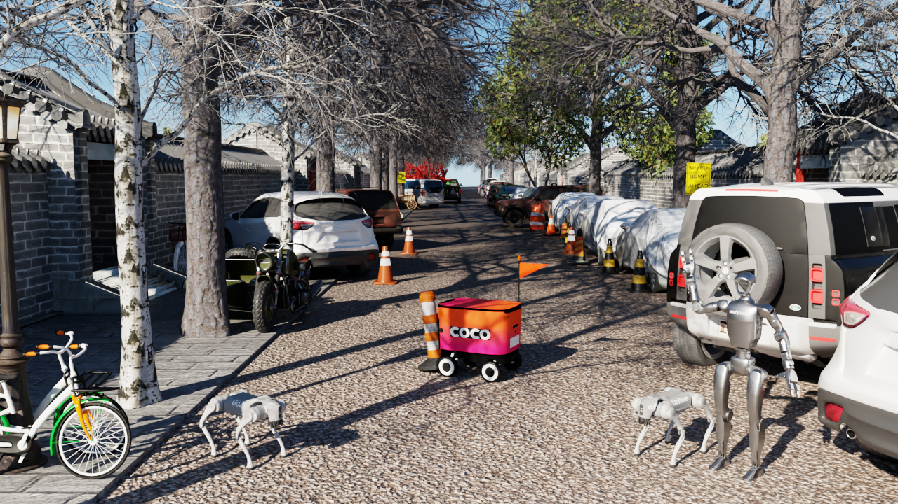

# UrbanVerse: Scaling Urban Simulation by Watching City-Tour Videos

**ICLR, 2026**

[](https://urbanverseproject.github.io/)
[](https://arxiv.org/abs/2510.15018)
[](https://github.com/VAIL-UCLA/UrbanVerse)
[](https://huggingface.co/datasets/Oatmealliu/UrbanVerse-100K)


---

<div align="left" style="margin: 16px 0;">

**Mingxuan Liu<sup>1,2,\*</sup>, Honglin He<sup>1,\*</sup>, Elisa Ricci<sup>2,3</sup>, Wayne Wu<sup>1</sup>, Bolei Zhou<sup>1</sup>** (*Equal contribution)

<sub><sup>1</sup>University of California, Los Angeles &nbsp;&nbsp; 
<sup>2</sup>University of Trento &nbsp;&nbsp; 
<sup>3</sup>Fondazione Bruno Kessler</sub>

</div>

---

> *Introducing **UrbanVerse** — a system that converts real-world urban scenes from city-tour videos into physics-aware, interactive simulation environments enabling scalable robot learning in urban spaces with real-world generalization.*

> *Click the image below to watch the introductory video.*


<a href="https://www.youtube.com/watch?v=zMvDiAVUY5I">
  
</a>


## Updates
- **Oct 20, 2025** — UrbanVerse technical report is now available [here](https://urbanverseproject.github.io/)

## Open-Source Roadmap (priority order)
- [x] **UrbanVerse-100K Dataset**: release annotations and rescaled assets
- [x] **UrbanVerse-100K Dataset Toolkit**: release Python package `urbanverse-asset`
- [ ] **CraftBench scenes**: release the 10 professionally designed test-only scenes
- [ ] **UrbanVerse Scenes Repository**: release the 160 simulation-ready urban scenes generated by UrbanVerse
- [ ] **UrbanVerse-Gen Pipeline**: release the real-to-sim automatic scene construction code
- [ ] **RL Training Pipeline**: release in-simulation policy training and evaluation code

> Status will be updated as each component is released. If you use UrbanVerse, please cite the paper.


## Citation
```bibtex
@inproceedings{
    liu2026urbanverse,
    title={UrbanVerse: Scaling Urban Simulation by Watching City-Tour Videos},
    author={Mingxuan Liu and Honglin He and Elisa Ricci and Wayne Wu and Bolei Zhou},
    booktitle={The Fourteenth International Conference on Learning Representations},
    year={2026},
}
```