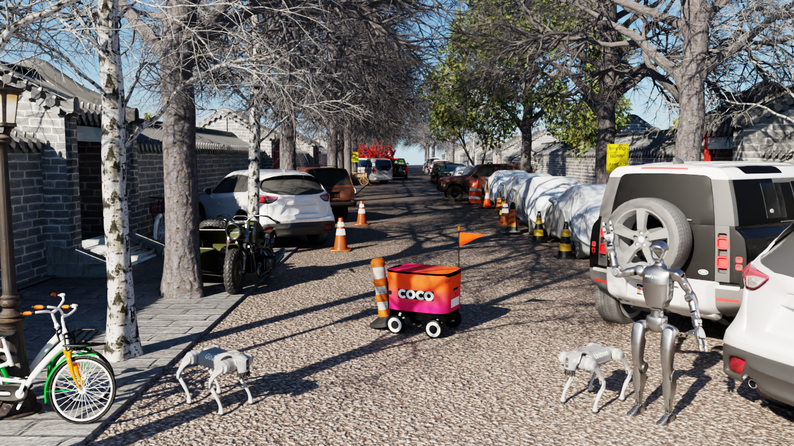
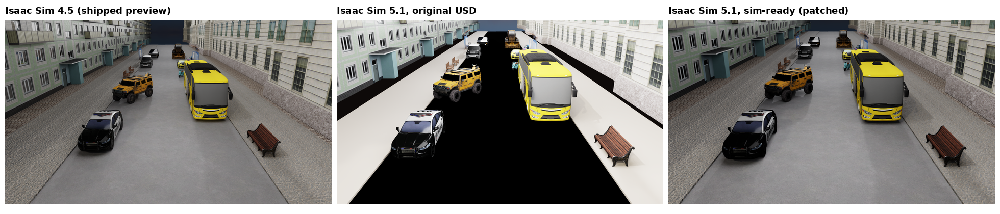

# UrbanVerse: Scaling Urban Simulation by Watching City-Tour Videos

**ICLR, 2026**

[](https://urbanverseproject.github.io/)
[](https://arxiv.org/abs/2510.15018)
[](https://github.com/VAIL-UCLA/UrbanVerse)
[](https://huggingface.co/datasets/Oatmealliu/UrbanVerse-100K)
[](https://huggingface.co/datasets/Oatmealliu/UrbanVerse-CraftBench)


---

<div align="left" style="margin: 16px 0;">

**Mingxuan Liu<sup>1,2,\*</sup>, Honglin He<sup>1,\*</sup>, Elisa Ricci<sup>2,3</sup>, Wayne Wu<sup>1</sup>, Bolei Zhou<sup>1</sup>** (*Equal contribution)

<sub><sup>1</sup>University of California, Los Angeles &nbsp;&nbsp; 
<sup>2</sup>University of Trento &nbsp;&nbsp; 
<sup>3</sup>Fondazione Bruno Kessler</sub>

</div>

---

> *Introducing **UrbanVerse** — a system that converts real-world urban scenes from city-tour videos into physics-aware, interactive simulation environments enabling scalable robot learning in urban spaces with real-world generalization.*

> *Click the image below to watch the introductory video.*


<a href="https://www.youtube.com/watch?v=zMvDiAVUY5I">
  
</a>


## Updates
- **Sep 02, 2026** - Sim-ready (Isaac Sim ≥ 5) releases on HuggingFace: [CraftBench](https://huggingface.co/datasets/UCLA-VAIL/UrbanVerse-CraftBench-Sim-Ready), [Training Scenes](https://huggingface.co/datasets/UCLA-VAIL/UrbanVerse-Training-Scenes-Sim-Ready) and [Assets](https://huggingface.co/datasets/UCLA-VAIL/UrbanVerse-Assets-Sim-ready) — see [below](#sim-ready-conversion-progress)
- **Aug 11, 2026** - Converting all assets & scenarios to sim-ready: in progress — see [live progress](#sim-ready-conversion-progress)
- **Jul 08, 2026** - UrbanVerse simulation-ready urban scenes are released [here](https://huggingface.co/datasets/UCLA-VAIL/UrbanVerse-Training-Scenes)
- **Mar 19, 2026** - CraftBench scenes are released [here](https://huggingface.co/datasets/Oatmealliu/UrbanVerse-CraftBench) 
- **Mar 06, 2026** - UrbanVerse-100K 3D asset database is released [here](https://huggingface.co/datasets/Oatmealliu/UrbanVerse-100K)
- **Oct 20, 2025** - UrbanVerse paper is now available [here](https://urbanverseproject.github.io/)

## Sim-Ready Conversion Progress

Converting all UrbanVerse assets & scenarios to simulation-ready (Isaac Sim ≥ 5) format, in batches.

<!-- sim-ready-progress:start -->
**Assets:** `███████████████░░░░░░░░░░` 61,000 / 102,445 (59.5%)

**Scenarios:** `█████████████████████████` 387 / 387 (100.0%)
<!-- sim-ready-progress:end -->

<sub>Maintainers: after each batch, run `python scripts/update_progress.py --add-assets N --add-scenarios N` (or `--assets-done` / `--scenarios-done` for absolute counts).</sub>

**Releases**

| | HuggingFace | source | what changed |
| --- | --- | --- | --- |
| Training scenes | [UCLA-VAIL/UrbanVerse-Training-Scenes-Sim-Ready](https://huggingface.co/datasets/UCLA-VAIL/UrbanVerse-Training-Scenes-Sim-Ready) | all **375** generated scenes (66 city walks; the original [UrbanVerse-Training-Scenes](https://huggingface.co/datasets/UCLA-VAIL/UrbanVerse-Training-Scenes) release holds the first 107) | ground-material `texture_scale` re-authored as `float2` so roads/sidewalks/terrain render in Isaac Sim 5.x; one `scene.tar` per scene (1.0 TB total) plus one preview still per city walk |
| CraftBench scenes | [UCLA-VAIL/UrbanVerse-CraftBench-Sim-Ready](https://huggingface.co/datasets/UCLA-VAIL/UrbanVerse-CraftBench-Sim-Ready) | [UrbanVerse-CraftBench](https://huggingface.co/datasets/Oatmealliu/UrbanVerse-CraftBench) (12) | same fix, same per-scene tar packaging |
| Assets | [UCLA-VAIL/UrbanVerse-Assets-Sim-ready](https://huggingface.co/datasets/UCLA-VAIL/UrbanVerse-Assets-Sim-ready) | [UrbanVerse-100K](https://huggingface.co/datasets/Oatmealliu/UrbanVerse-100K) | GLB → USD: Z-up, metric, base on `z=0`, rigid body + convex-decomposition collision; one tar per asset in 256 buckets (`usd/<uid[:2]>/std_<uid>.tar`) |



<sub>Why scenes needed fixing: Isaac Sim 4.5 rejected the scenes' `int` `texture_scale` and fell back to each MDL's default tile size; Isaac Sim 5.x rejects it too but then renders the surface flat black/white. The sim-ready scenes bake that default in as a proper `float2`, so 5.x shows what 4.5 showed. Tooling: [`scripts/upgrade_isaacsim5.md`](scripts/upgrade_isaacsim5.md), [`scripts/convert_scenes_simready.py`](scripts/convert_scenes_simready.py); per-scene provenance in [`scenes/`](scenes/).</sub>

## Open-Source Roadmap (priority order)
- [x] **UrbanVerse-100K Dataset**: release annotations and rescaled assets
- [x] **UrbanVerse-100K Dataset Toolkit**: release Python package `urbanverse-asset`
- [x] **CraftBench scenes**: release the 10 professionally designed test-only scenes
- [x] **Scene Toolkit**: release Python package `urbanverse-scene`
- [x] **UrbanVerse Scenes Repository**: release the simulation-ready urban scenes generated by UrbanVerse — [available here](https://huggingface.co/datasets/UCLA-VAIL/UrbanVerse-Training-Scenes)
- [ ] **All Assets & Scenarios Sim-Ready**: convert the full corpus — [live progress](#sim-ready-conversion-progress); releases: [CraftBench](https://huggingface.co/datasets/UCLA-VAIL/UrbanVerse-CraftBench-Sim-Ready), [training scenes](https://huggingface.co/datasets/UCLA-VAIL/UrbanVerse-Training-Scenes-Sim-Ready), [assets](https://huggingface.co/datasets/UCLA-VAIL/UrbanVerse-Assets-Sim-ready)
- [ ] **UrbanVerse-Gen Pipeline**: release the real-to-sim automatic scene construction code
- [ ] **RL Training Pipeline**: release in-simulation policy training and evaluation code

> Status will be updated as each component is released. If you use UrbanVerse, please cite the paper.


## Citation
```bibtex
@inproceedings{
    liu2026urbanverse,
    title={UrbanVerse: Scaling Urban Simulation by Watching City-Tour Videos},
    author={Mingxuan Liu and Honglin He and Elisa Ricci and Wayne Wu and Bolei Zhou},
    booktitle={The Fourteenth International Conference on Learning Representations},
    year={2026},
}
```