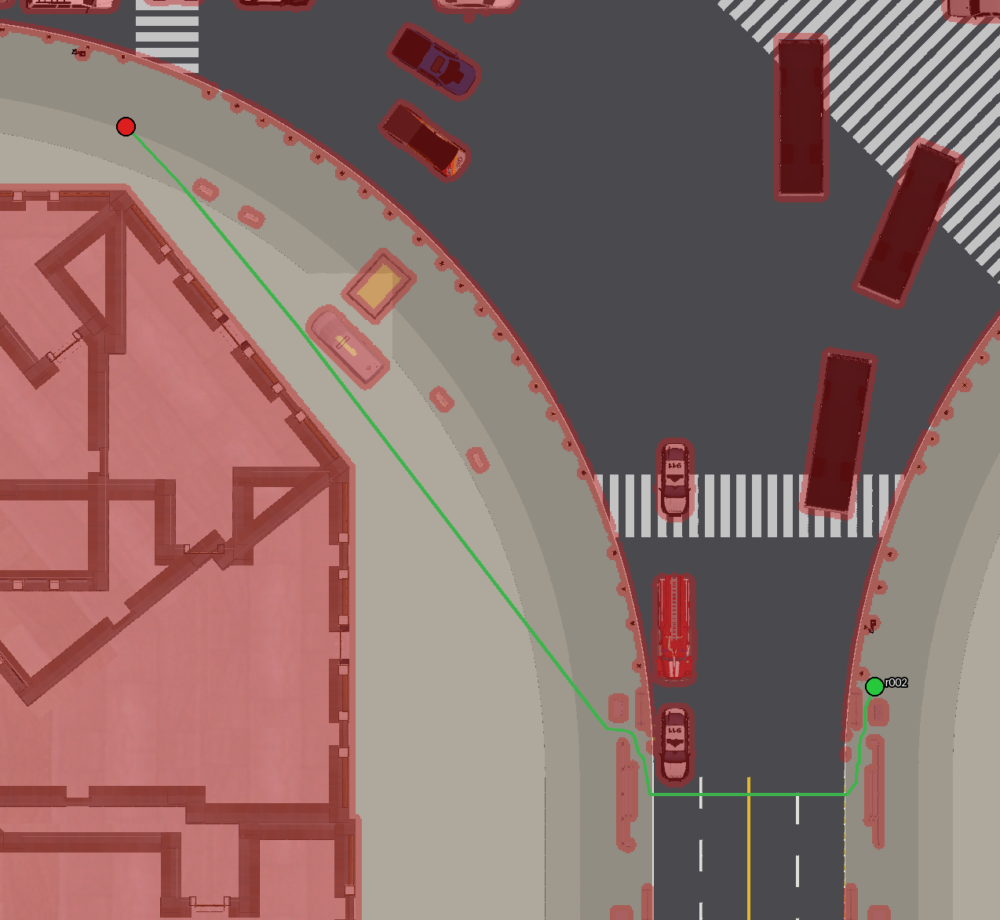

# CraftBench-Nav

Sidewalk-robot navigation routes for the 12 CraftBench scenes: top-down maps of each scene,
a browser page to annotate start and goal points, and a planner that turns them into reference
routes with waypoints and route maps. No Isaac Sim and no GPU needed.



## Quick start

```bash
pip install -r navbench/requirements.txt                  # Python 3.10+
python navbench/render_topdown.py                         # 1. maps of all scenes (~10 min)
python navbench/annotate.py                               # 2. annotate: open http://localhost:8765
python navbench/generate_routes.py                        # 4. plan the routes, draw the route maps
```

The scenes are found where the urbanverse-scene toolkit put CraftBench (`--root` to point
elsewhere). Then, in evaluation code:

```python
from navbench.routes import load_routes       # with navbench/ on sys.path
for r in load_routes("scene_07"):
    r["start"], r["goal"], r["waypoints"]     # pose, goal, N x 4 array (x, y, z, yaw)
```

To try it without annotating first: `python navbench/tests/make_examples.py`, then
`python navbench/generate_routes.py --routes navbench/routes/examples`.

## Steps

| Step | Script | Page |
| --- | --- | --- |
| 0 | the plan | [docs/00_plan.md](docs/00_plan.md) |
| 1 | `render_topdown.py`: metric top-down maps and planner layers from the scene geometry | [docs/01_topdown.md](docs/01_topdown.md) |
| 2 | `annotate.py`: click start and goal, see the route, saved at once | [docs/02_annotate.md](docs/02_annotate.md) |
| 3 | the route files (`.json`, `.npy`, `.txt`) and `load_routes` | [docs/03_format.md](docs/03_format.md) |
| 4 | `generate_routes.py`: planner, waypoints, facts, route maps | [docs/04_routes.md](docs/04_routes.md) |

## Layout

```
navbench/
├── render_topdown.py, annotate.py, generate_routes.py
├── navbench/          scene reader (scene.py, glb.py), rasterizer (raster.py), maps (maps.py, topdown.py),
│                      planner.py, routes.py (files), draw.py (route maps), web/ (the annotation page)
├── maps/<scene>/      built by step 1; not in git
├── routes/            annotations (<scene>.json) and planned routes (<scene>/); examples/ is test data
├── tests/             one test per part (below)
└── docs/
```

## Tests

```bash
python navbench/tests/test_planner.py      # planner and route files, on a made-up map (seconds)
python navbench/tests/test_maps.py         # map ground heights vs Isaac Sim 5.1's recorded ground hits
python navbench/tests/test_annotate.py     # the annotation page in headless Chrome
```

## Memory

Building a map loads the whole scene once per worker process, up to ~4 GB each.
`render_topdown.py` starts as many workers as the free memory holds (and no more than there
are cores), leaving 4 GB to the rest of the machine; `--workers N` overrides it. Planning and
annotating take up to ~1.3 GB per scene (the largest), and the annotation server keeps at most
3 scenes.
