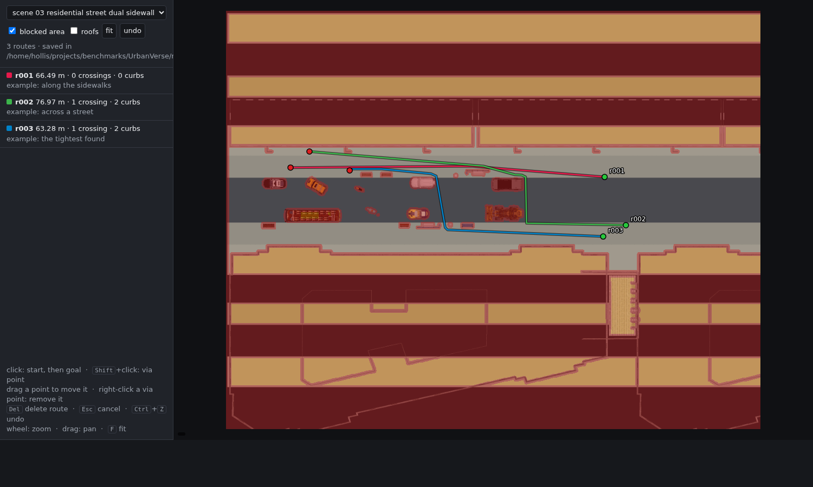

# Step 2: annotating routes

```bash
python navbench/annotate.py            # then open http://localhost:8765
```

On a remote machine, forward the port first: `ssh -L 8765:localhost:8765 <host>`, then open
the same address on your own machine. The page needs the maps of [step 1](01_topdown.md).



## What you do

Pick a scene at the top left. The map is `cut.png` (without roofs and tree crowns); **roofs**
shows `topdown.png` instead. **Blocked area** shades in red what the robot cannot use (walls,
parked cars, bollards, anything closer than the robot's radius, curbs too high to climb) and in
orange walkable places that are sealed off from the streets, like the inside of a building.

| To | Do |
| --- | --- |
| add a route | click the start, then the goal |
| add a via point to the selected route | Shift + click |
| move a start, goal or via point | drag it |
| remove a via point | right-click it |
| select a route | click one of its points, or its line in the list |
| delete the selected route | Delete (or the button) |
| cancel a start you clicked | Esc |
| undo | Ctrl + Z (all the way back to when the scene was opened) |
| write a note on the selected route | the text box |
| pan / zoom / fit | drag / wheel / F |

As soon as a route has a start and a goal it is planned, with the same planner that
`generate_routes.py` uses ([step 4](04_routes.md)), and drawn. The list shows its length, road
crossings and curbs; the panel above it all its facts. A route that cannot be planned stays as
a dashed line with the reason in red: the start or goal is blocked, or the goal cannot be
reached. Move the point, or delete the route.

Via points are for routes the planner would not choose by itself: crossing the street where
there is no crosswalk, going around a block the other way, passing through a narrow gap. A
route goes through its via points in order; a new one is put where it lengthens the route least.

## Saving

There is no save button. Every change (a new route, a moved point, a deletion, an undo, a note)
is written to `navbench/routes/<scene>.json` at once; the status line says when it was last saved,
and turns red if saving failed. The file is written to a temporary name first and then renamed,
so a crash never leaves half a file. The format is in [step 3](03_format.md).

Route ids are `r001`, `r002`, ... per scene, never reused while the scene is open: a deleted
route's id is not given to the next one (unless it was the last one).

## Options

| Option | Default | |
| --- | --- | --- |
| `--port` | 8765 | |
| `--host` | 127.0.0.1 | only this machine can open the page; `0.0.0.0` opens it to the network |
| `--routes` | `navbench/routes` | where the annotation files go |
| `--robot` | delivery | whose walkable area and routes the preview shows (`delivery`, `quadruped`, `wheelchair`) |

The robot only changes the preview: the files hold the clicked points, not the planned paths.

## How it works

`annotate.py` is a small web server from the Python standard library. It serves one page
(`navbench/web/annotate.html`, plain HTML and JavaScript, nothing to install or build) and:

| Request | Answer |
| --- | --- |
| `GET /api/scenes` | the scenes with maps, and how many routes each has |
| `GET /api/scene?name=` | a scene's map frame and its annotations |
| `GET /map/<scene>/cut.png` | the map images |
| `GET /overlay/<scene>.png` | the blocked area, one pixel per planner cell |
| `POST /api/plan` | plan a route through the given points |
| `POST /api/save` | write a scene's annotations |

The planner of a scene is made when the scene is first opened (about 3 s for the largest)
and kept for the next requests; at most 3 scenes are kept, to bound memory.

## Tested

`tests/test_annotate.py` starts the server with an empty temporary routes folder, opens the page
in headless Chrome with a temporary profile, and lets `navbench/web/selftest.js` drive it with
real mouse and key events: add a route, add a via point, drag the goal, remove the via point,
write a note, add a second route, delete it, undo, delete again. Each step waits until the page
has saved; at the end the file on disk has to hold exactly what the page shows.

```bash
python navbench/tests/test_annotate.py scene_01
```
